

# IPFS Logo

click to toggle background color

## cube + text

### vector

<joined>

</joined>
<joined>
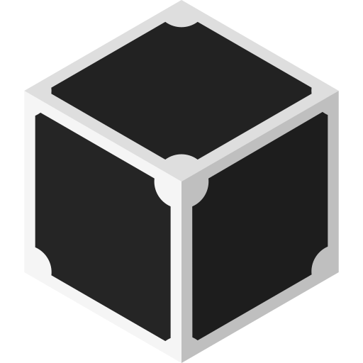
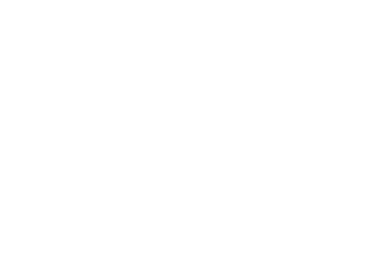
</joined>
<joined>

</joined>
<joined>

</joined>

### 128

### 256

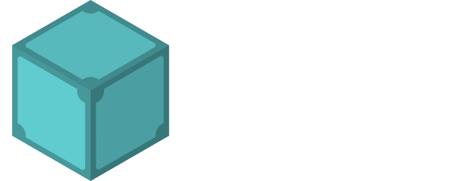

### 512

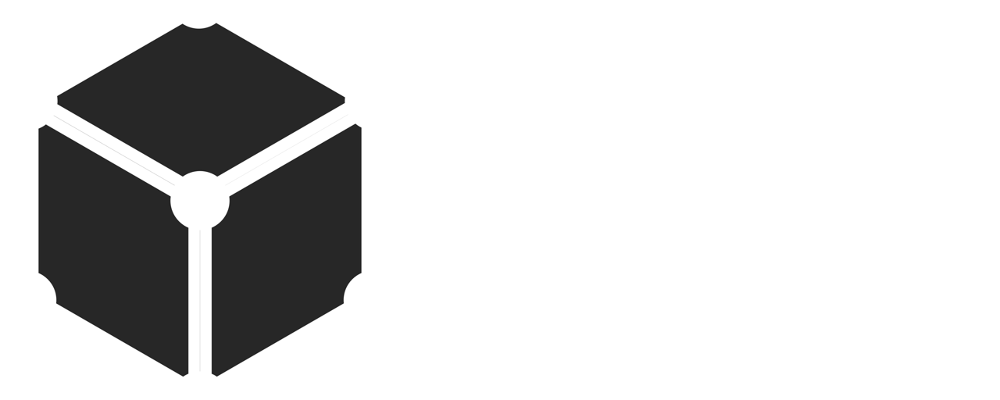

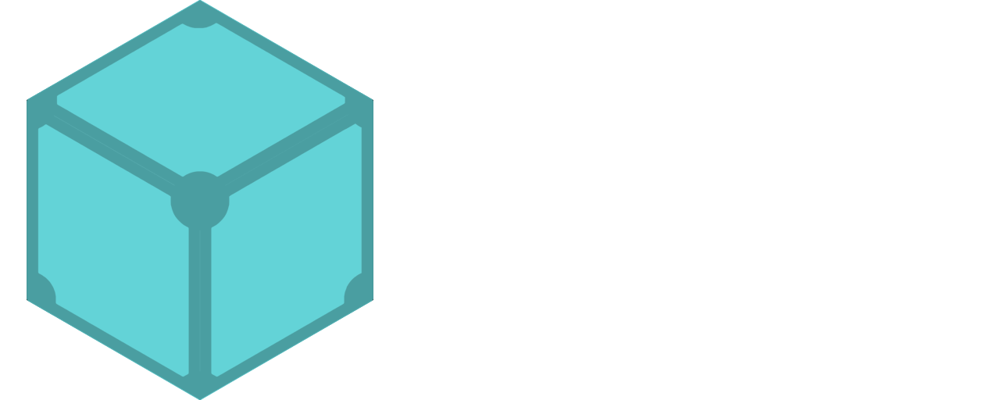

### 1024

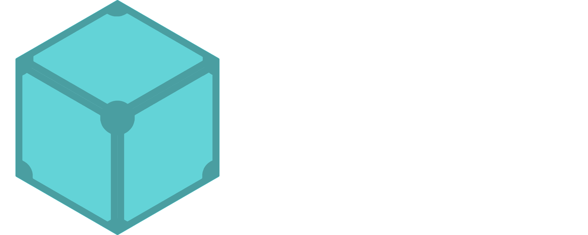

## cube only

### vector

### 128

### 256

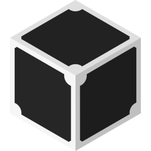
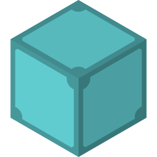

### 512

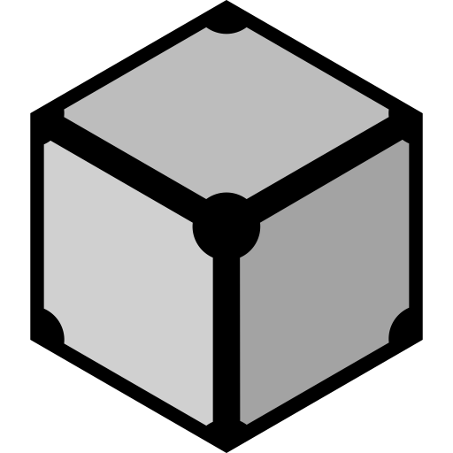

### 1024

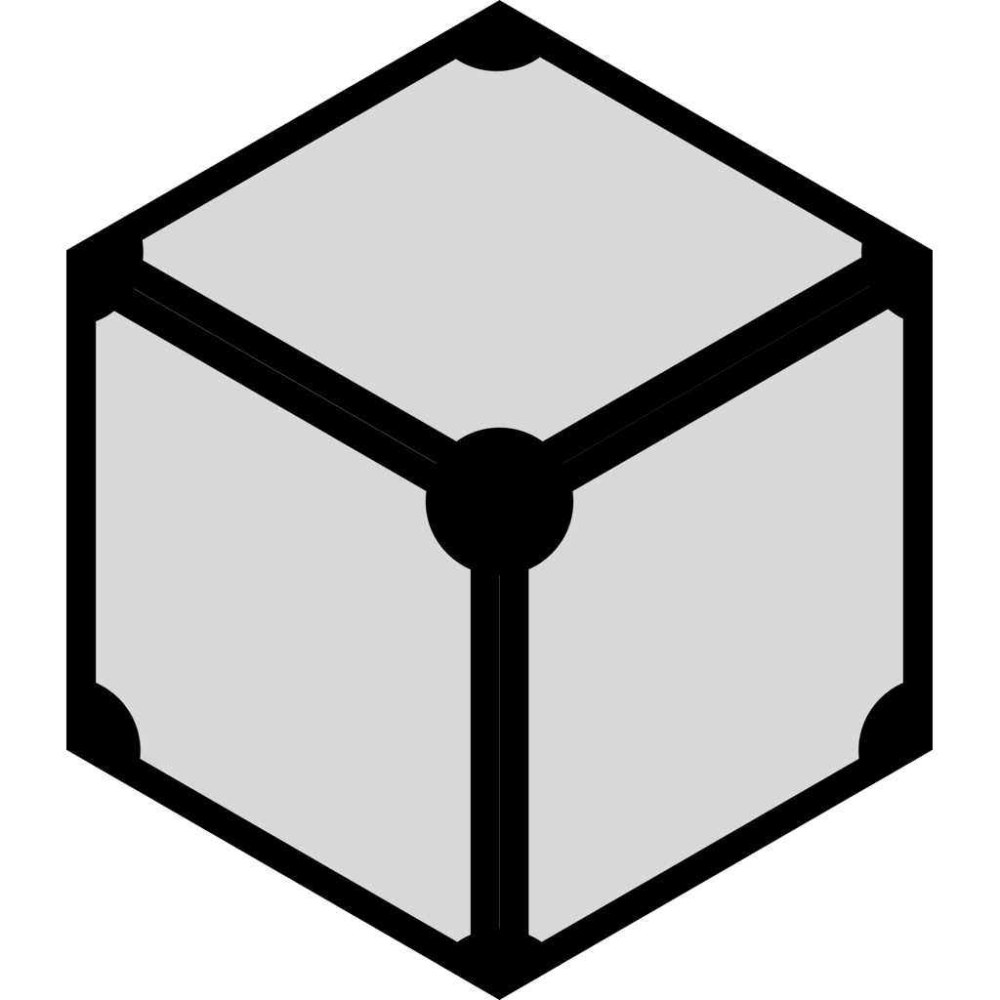
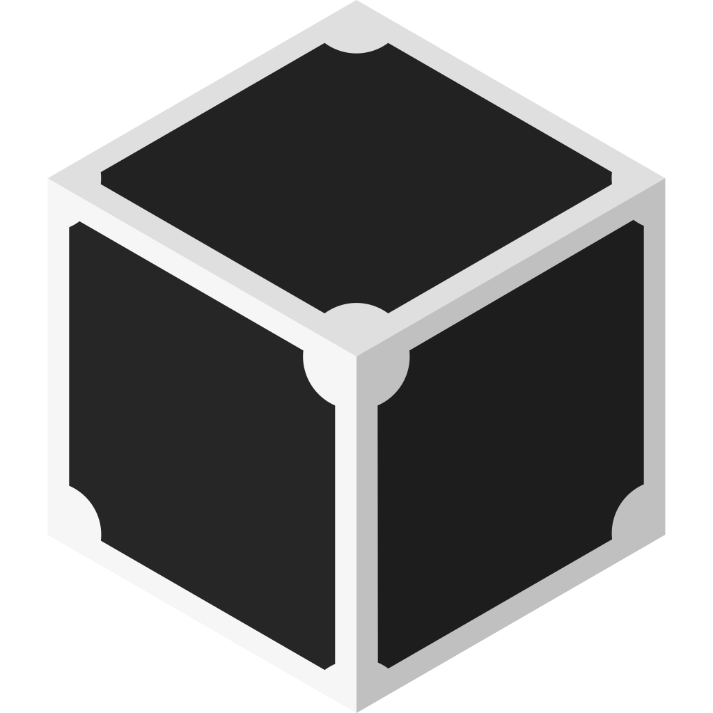

## tessellated

